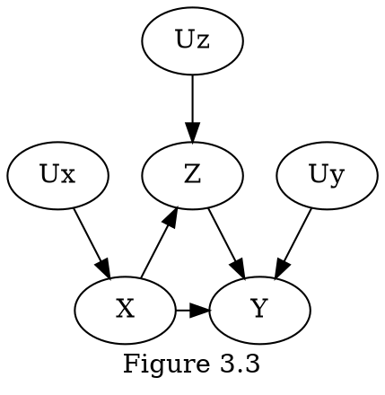
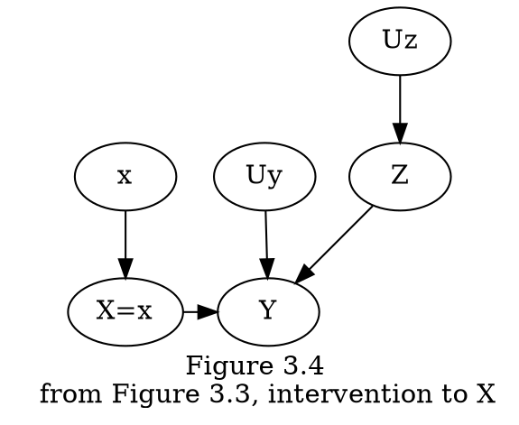
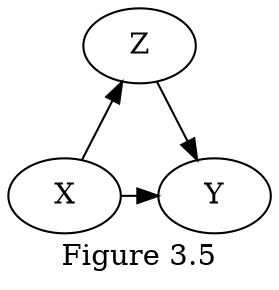
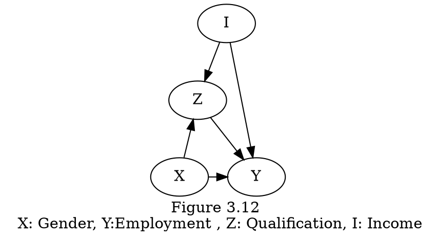

# Chapter 3. 개입의 효과

## 3.1 개입
**do-expressions $do(X=x)$**: 의도적으로 $X=x$로 만드는 연산

## 3.2 조정 공식
**Average Causal Effect**: $P(Y=1|do(X=1)) - P(Y=1|do(X=0)$ 

**인과 효과 추정을 위해 $P_{m}$이 $P$를 대신할 수 있는 이유** 

- 첫째, $Z$에서 X까지의 화살표를 제거하는 것이 Z를 결정하는 과정에 영향을 미치지 않음.
- 둘째, X가 자발적으로 변하거나 의도적인 조작에 의해 변하는 것과 관계없이, $Y$가 $X$와 $Z$에 반응하는 과정, $Y=f(x,z,u_{Y})$가 동일하기 때문에 조건부 확률 $P(Y=y|X=x,Z=z)$는 변하지 않는다.
$P_{m}(Y=y|X=x,Z=z)=P(Y=y|X=x,Z=z)$, $P_{m}(Z=z) = P(Z=z)$

**adjustment formula(조정 공식)**: $P(Y=y|do(X=x))=\sum\limits_{z}P(Y=y|X=x,Z=z)P(Z=z)$
조정 공식 절차를 "adjusting for Z(Z에 대한 조정)" 또는 "cotrolling for Z(Z에 대한 통제)"라고 한다.

**adjustment formula를 필요로 하지 않는 상황**

이러한 구조에서는 $X$의 부모가 없기 때문에 $X$로 들어오는 화살표가 없음을 보여준다. 이것은 수술(화살표 제거)가 필요 없다는 것을 의미한다. 데이터가 생성된 조건은 "랜덤하게" treatment가 할당된 것과 같았다. 환자가 처방($X$)를 선호하거나 거부하게 하는 요인이 있다면, 그러한 요인이 모형에 나타나야 한다. 그러한 요인이 없으면 $X$를 randomization treatment로 간주해도 된다.
$P(Y=y|do(X)) = P(Y=y | X=x)$

$P(Y | do(X))$를 구하고자

**규칙 1 (인과 효과 규칙)**
변수 집합 $PA$가 $X$의 부모일 때, 그래프 $G$가 주어지면 $Y$에 대한 $X$의 인과효과는 다음과 같다.
$P(Y=y|do(X=x))=\sum\limits_{z}P(Y=y|X=x,PA=z)P(PA=z)$ 
이때 $z$는 $PA$가 가질 수 있는 모든 값의 집합에 포함된다.

**g-formula(또는 truncated product formula)**: $X_{i}$가 $X$에 속하지 않는 모든 $i$에 대해서, $P(x_1,x_2, \cdots , x_n | do(x))=\prod\limits_{i}P(x_{i}|{pa}_{i})$

**g-formula를 이용한 사후 개입 분포**
$P(z_{1}, z_{2}, w, y | do(X = x, Z_{3} = z_{3})) = P(z_{1})P(z_{2})P(w|x)P(y|w, z_3, z_2)$

**사전 개입 분포와 사후 개입 분포 관계의 의한 관계**: $P(z,y|do(x))= \dfrac{P(x,y,z)}{P(x|z)}$
이것은 분포 $P(x,y,z)$에 의해 결정되는 비실험적 데이터로부터 개입 $do(x)$의 효과를 예측하기 위해서는 조건부 확률 $P(x|z)$만 알면 된다는 것을 뜻한다.
>**Proof**
>preintervention distribution(사전 개입 분포): $P(x,y,z)=P(z)P(x|z)P(y|x,z)$ (그림 3.3)
>postintervention distribution(사후 개입 분포): $P(z,y|do(x))=P_{m}(z)P_{m}(y|x,z)=P(z)P(y|x,z)$ (그림 3.4)
>두 식을 결합하면 $P(z,y|do(x))$를 도출할 수 있다.

## 3.3 뒷문 기준
**정의 3.3.1 (뒷문 기준)**
방향성 비순환 그래프 (directed acyclic graph, DAG) $G$에서 순서쌍 변수 $(X,Y)$가 주어졌을 때, $Z$에 있는 어떤 노드도 $X$의 자손이 아니면 변수들의 집합 $Z$는 $(X,Y)$에 대한 뒷문 기준을 만족하며, $Z$는 $X$와 $Y$ 사이의 $X$로 들어가는 모든 경로를 차단한다.
1. $X$와 $Y$ 사이의 모든 spurious paths(허위 경로)를 차단한다.
2. $X$에서 $Y$로가는 모든 인과 경로(all directed path)를 그대로 둔다.
3. 새로운 spurious paths를 만들지 않는다.

**W-specific(W 특정) 인과효과**
92쪽

## 3.4 앞문 기준
**정의 3.4.1 (앞문 기준)**
다음 기준을 만족하면, 변수 $Z$의 집합은 변수의 순서쌍 $(X,Y)$에 대한 앞문 기준을 만족한다.
1) $Z$는 $X$에서 $Y$로 향하는 모든 경로를 방해한다.
2) $X$에서 $Z$까지 차단 해제된 경로 (unblocked paths)가 없다.
3) $Z$에서 $Y$까지의 모든 뒷문 경로 (backdoor paths)는 $X$에 의해 차단된다.

**정리 3.4.1 (앞문 조정)**
$Z$가 $(X,Y)$에 대해 앞문 기준을 만족하고 $P(x,z)>0$인 경우 $Y$에 대한 $X$의 인과 효과는 식별 가능하며 다음 식으로 표현할 수 있다.
$\begin{equation}\begin{split} P(y|do(x)) & =\sum\limits_{z}P(z|x)\sum\limits_{x'}P(y|x',z)P(x') \\ & = \sum\limits_{z} \Big( \sum\limits_{x'}P(y|z,x')P(x') \Big) P(z|x) \\ & = \sum\limits_{z}P(Y=y|do(Z=z))P(Z=z|do(X=x)) \end{split}\end{equation}$
>**Proof**
>$X$에서  $Z$로 들어가는 뒷문 경로가 없으므로 $P(Z=z|do(X=x))=P(Z=z|X=x)$
>$Z$에서  $Y$로 들어가는 뒷문 경로, 즉 $Z \leftarrow X \leftarrow U \rightarrow Y$가 $X$에 대한 조건부를 통해 차단될 수 있기 때문에  $Y$에 대한 $Z$의 효과도 파악할 수 있다. $P(Y=y|do(Z=z))= \sum\limits_{x}P(Y=y|Z=z,X=x)P(X=x)$
>$P(Y=y|do(X=x))= \sum\limits_{z}P(Y=y|do(Z=z))P(Z=z|do(X=x))$이므로
>$\begin{equation}\begin{split} P(Y=y|do(X=x)) & = \sum\limits_{z}P(Y=y|do(Z=z))P(Z=z|do(X=x)) \\ & = \sum\limits_{z}\sum\limits_{x'}P(Y=y|Z=z,X=x')P(X=x')P(Z=z|X=x) \end{split}\end{equation}$로 표기할 수 있다.
>자세한 내용은 그림 3.10 (b)

## 3.5 조건부 개입 및 공변량 관련 효과
**z-specific effect(z-특정 효과) $P(Y=y|do(x=x),Z=z)$**: 개입 후에 $Z$가 값 $z$를 갖는 모집단의 하위 집합에서 $Y$의 분포를 측정한다.
z-specific effect는 뒷문 조정과 유사한 절차로 식별할 수 있다.(ex> $Z$를 조건부 집합에 추가함으로서 뒷문 차단)

**규칙 2** $S \cup Z$가 뒷문 기준을 충족하는 변수 집합 $S$를 측정할 수 있을 때에는 z-specific effect(z-특정 효과) $P(Y=y|do(x=x),Z=z)$가 식별된다.

**z-specific effect(z-특정 효과)의 adjustment formula(조정 공식)** modified adjustment formula(수정된 조정공식)
$P(Y=y|do(x=x),Z=z) = \sum\limits_{s}P(Y=y|X=x,S=s,Z=z)P(S=s|Z=z)$
>adjustment formula(조정 공식)과의 차이점
>1. 조정 집합(adjustment set)은 $S$ 뿐 아니라 $S \cup Z$ 
>2. $Z$가 아닌 $S$에 대해서만 조건부 확률을 더하는 것

**conditional intervention**: $P(Y=y|do(X=g(Z))) = \sum\limits_{z}P(Y=y|do(X=x), z)|_{x=g(z)}P(Z=z)$
> **Proof**
> $\begin{equation}\begin{split}P(Y=y|do(X=g(Z))) & = \sum\limits_{z}P(Y=y|do(X=x), z)P(Z=z|do(X=G(Z))) \\ & = \sum\limits_{z}P(Y=y|do(X=x), z)P(Z=z)\end{split}\end{equation}$
> $Z$가 $X$보다 먼저 일어나므로 $P(Z=z|do(X=G(Z))) = P(Z=z)$

## 3.6 역확률 가중치

**inverse probability weighting**: $P(y|do(x))=\sum\limits_{z}\dfrac{P(Y=y,X=x,Z=z)}{P(X=x|Z=z)}$
>**Proof**
>$\begin{equation}\begin{split} P(Y=y|do(X=x)) & =\sum\limits_{z}P(Y=y|X=x,Z=z)P(Z=z) \\ & = \sum\limits_{z}\dfrac{P(Y=y|X=x,Z=z) P(X=x|Z=z) P(Z=z))}{P(X=x|Z=z)} \\ & =\sum\limits_{z}\dfrac{P(Y=y,X=x,Z=z)}{P(X=x|Z=z)}  \end{split}\end{equation}$
>이러한 과정을 통해 adjustment formula(조정 공식)을 propensity score(성향 점수) $P(X=x|Z=z)$를 통해 inverse probability weighting(역확률 가중치)로 표현할 수 있다.  

이러한 inverse probability weighting(역확률 가중치)는 뒷문 기준을 만족하는 경우에만 이용할 수 있다.

**adjustment formula 대신 IPW를 이용하는 이유**
- adjustment formula의 경우 $Z$의 값이 다양할수록 계산양이 많아지는 반면 해당 stratum(계층)내에 존재하는 데이터 표본 수가 줄어들어 신뢰성이 떨어질 수 있다.
- 또한 $P(X=x | Z=z)$를 이용할 수 있다고 가정하면, $P(x, y, z)$가 아닌 사후 개입 확률(postintervention probability) $P_m$에서 계산된 것처럼 나타나는 가상의 표본(artificial samples)를 생성하는 데 이용할 수 있다. 그런 가상의 표본을 얻으면 표본의 각 계층 $X=x$에 대해 $Y=y$의 빈도를 간단히 계산하여 $P(Y=y|do(x))$를 계산할 수 있다.

**주의사항**
 - 가중치의 재분배(redistribution of weight)는 더 이상 비례(proportional)하지 않지만 차별적(discriminatory)이라는 점이다.
 - 계산량의 감소는 없다.
 - Backdoor Criterion을 만족하는 경우에만 IPW를 이용할 수 있다. 이러한 확신을 할 수 없을 때, IPW를 이용하면 순수하게 조건부를 통해 얻은 결과보다 실제로 편의(bias가 생겨서 Simpson's Paradox가 나타날 수 있다.

## 3.7 매개

**그림 3.12로 확인하는 조건부의 문제점**
Z를 조건부로 하면 X -> Z -> Y간의 indirect dependence(간접 의존도)는 차단되지만 X -> Z <- I -> Y 간의 indirect dependence가 생겨나는 문제점이 있다. 이러한 문제를 해결하기 위해 조건부 대신에 자격을 고정(fix the qualifications)하는 방법을 이용할 수 있다.  

이를 나타내는 값인 Controlled Direct Effect(통제된 직접 효과, CDE)는 다음과 같이 정의할 수 있다.
$CDE = P(Y=y | do(X=x), do(Z=z)) - P(Y=y | do(X=x'), do(Z=z))$

**CDE의 특징**
- 조건부를 기반으로 한 정의를 이용하는 것보다 일반성이 유지된다.
- 관측된 확률로부터 개입된 확률을 식별할 수 있는 모든 경우에 $Y$에 대한 $X$의 직접 효과를 추정할 수 있다.

**표현식에 두 개의 do-operator가 존재할 때의 Direct Effect의 계산**
$\begin{equation}\begin{split}CDE & = P(Y=y | do(X=x), do(Z=z)) - P(Y=y | do(X=x'), do(Z=z)) \\ &= P(Y=y | X=x, do(Z=z)) - P(Y=y | X=x', do(Z=z)) \\ &= \sum\limits_{i} [P(Y=y | X=x, Z=z, I=i)P(I=i) - P(Y=y | X=x', Z=z, I=i)P(I=i)]\end{split}\end{equation}$
>**Description**
>Line 2: Chapter 3.2에서 'adjustment formula를 필요로 하지 않는 상황'을 참고
>Line 3: I를 통해 do-operator 연산

**CDE의 식별 가능 조건**
1. $Z$에서 $Y$까지 모든 뒷문 경로를 차단하는 변수 집합 $S_{1}$이 있다.
2. $Z$로 들어가는 모든 화살표를 삭제한 후 $X$에서 $Y$까지의 모든 뒷문 경로를 차단하는 변수 집합 $S_{2}$가 있다.

**간접 효과의 측정**

## 3.8 선형 시스템의 인과 추론

>It written by Obsidian and was used Obsidian Grapviz