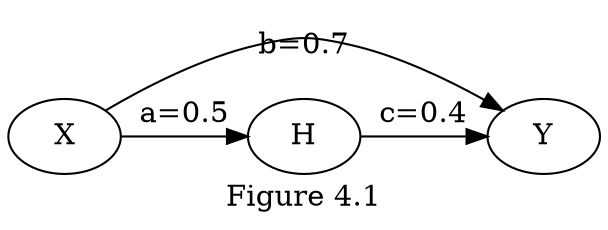
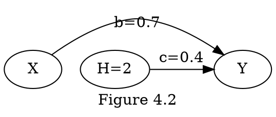
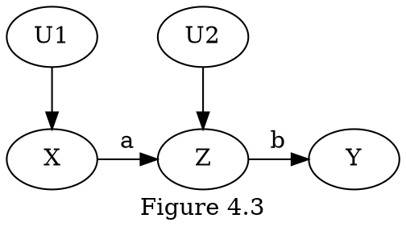
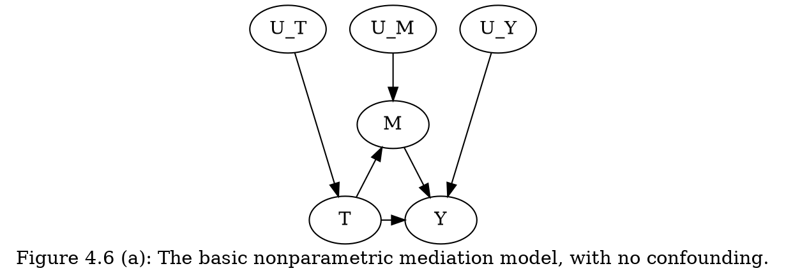
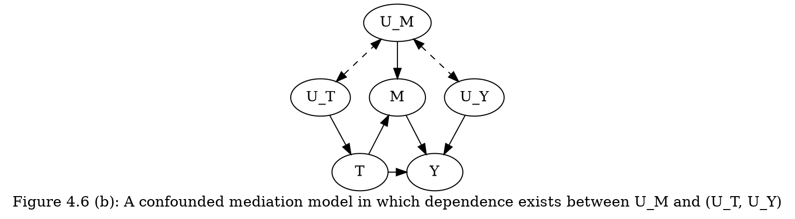

# Chapter 4. 반사실 추론과 응용

## 4.2 반사실 사건의 정의와 계산

### 4.2.1 반사실 사건의 구조적인 해석
**반사실 사건의 정확한 값을 계산하는 방법**
$Y_{x}(u)=y$: "$U=u$"라는 상황에서 $X$가 $x$였다면 $Y$가 $y$인 사건
- do-operator는 확률분포에서만 정의되며, 곱 분해 식 $P(x_{1}, x_{2}, \cdots , x_{n})=\prod\limits_{i} P(x_i | pa_{i})$에서$P(x_i | pa_{i})$ 요소가 아닌 항상 $E[Y|do(x)]$와 같은 기댓값 결과로 보여준다. 이 차이는 모집단과 개체 수준의 분석 사이의 심오한 차이를 반영한다. 이러한 차이는 광범위한 결과를 보여주며 신용, 비난, 후회와 같은 개념을 확률로 정의할 수 있다.

### 4.2.2 반사실 추론의 기본 법칙
반사실 사건 $Y_{x}(u)$의 공식 정의는 다음과 같다.
$Y_{x}(u) = Y_{M_x}(u)$
다시 말해서, 모형 $M$에서 반사실 사건 $Y_{x}(u)$는 "수정된(sugically modified)" 하위 모형(submodel) $M_{x}$에서 구한 $Y$의 해 (solution)로 정의된다. $M_{x}$는 $X$의 모든 원소의 방정식이 상수로 대체된 모형을 의미한다.

**consistency rule(일관성 규칙)**: 만약 $X=x$이면 $Y_x = Y$이다.
- 즉 $X$가 1일 때, $Y_{1}$은 $Y$의 관측값과 같다고 해석할 수 있다.
- ex> $X$가 이진 변수인 경우 $Y=XY_{1} + (1 - X)Y_{0}$과 같은 형태로 표현할 수 있다.

### 4.2.3 모집단 데이터부터 개인의 행동까지 - 예
**예시 모형**

$\begin{equation}\begin{split} X & = U_{X} \\ H & = a \cdot X + U_{H} \\ Y & = b \cdot X + c \cdot H + U_{Y} \\ \sigma_{U_{i} U_{j}} &= 0 \,\,\,\, \forall i,j \in \{X, H, Y\} \end{split}\end{equation}$

**Q.** 만약 $X=0.5, H=1, Y=1.5$인 Joe라는 학생이 숙제하는 시간($H$)를 두 배로 늘렸다면?
**A.**
_Step. 1_: Joe의 구체적인 특성 계산
$\begin{equation}\begin{split} U_{X} & = 0.5 \\ U_{H} & = 1 - 0.5 \cdot 0.5 = 0.75 \\ U_{Y} & = 1.5 - 0.7 \cdot 0.5 - 0.4 \cdot 1 = 0.75\end{split}\end{equation}$

_Step. 2_: 수정된 모형에서의 external intervention(외부 개입)계산

$Y_{H=2}(U_{X}=0.5, U_{H}=0.75, U_{Y}=0.75) = 0.5 \cdot 0.7 + 2.0 \cdot 0.4 + 0.75 = 1.90$

### 4.2.4 반사실 사건 계산의 3단계
**deterministic counterfactual(결정적 반사실 사건)을 계산하기 위한 3단계 과정**
1. abduction(귀추): 증거 $E=e$를 이용하여 $U$의 값을 정한다.
2. action(조치): 변수 $X$에 대한 구조 방정식을 제거하고 적절한 함수 $X=x$로 대체하여 모형 $M$을수정한 모형 $M_x$를 구한다.
3. 예측(prediction): 수정된 모형 $M_{x}$와 $U$의 값을 이용하여 반사실 사건의 결과인 $Y$의 값을 계산한다.

**임의의 반사실 사건이 주어졌을 때, $E[Y_{X=x}|E=e]$을 계산하기 위한 3단계 과정**
1. abduction(귀추): 증거 $E=e$를 이용하여 $P(U)$의 사후 확률인 $P(U|E=e)$를 구한다.
2. action(조치): 변수 $X$에 대한 구조 방정식을 제거하고 적절한 함수 $X=x$로 대체하여 모형 $M$을수정한 모형 $M_x$를 구한다.
3. 예측(prediction): 수정된 모형 $M_{x}$와 $P(U|E=e)$의 값을 이용하여 반사실 사건의 결과인 $Y$의 기값을 계산한다.

## 4.3 비결정적 반사실 사건
### 4.3.1 반사실 사건의 확률
**multiple-world counterfactuals(다중 세계의 반사실 사건)**
_모형 1_
$\begin{equation}\begin{split} X & = a \cdot U \\ Y & = b \cdot X + U \end{split}\end{equation}$
$P(U=1) = \frac{1}{2}, P(U=2) = \frac{1}{3}, P(U=3) = \frac{1}{6}$

| $u$ | $X(u)$ | $Y(u)$ | $Y_{1}(u)$ | $Y_{2}(u)$ | $Y_{3}(u)$ | $X_{1}(u)$ | $X_{2}(u)$ | $X_{3}(u)$ |
|---|------|------|----------|----------|----------|----------|----------|----------|
| 1 | 1    | 2    | 2        | 3        | 4        | 1        | 1        | 1        |
| 2 | 2    | 4    | 3        | 4        | 5        | 2        | 2        | 2        |
| 3 | 3    | 6    | 4        | 5        | 6        | 3        | 3        | 3        |

이러한 모형 하에서 모든 반사실 사건과 관찰 가능한 사건의 모든 조합의 결합 확률을 계산할 수 있다.
$\begin{equation}\begin{split} & P(Y_{2} > 3 , Y_{1} < 4) = \frac{1}{3} \\ & P(Y_{1} < 4, Y - X > 1) = \frac{1}{3} \\ & P(Y_{1} < Y_{2}) = 1  \end{split}\end{equation}$

**개입효과와 반사실 사건의 차이**

$\begin{equation}\begin{split} X & = U_{1} \\ Z & = a \cdot X + U_{2} \\ Y & = b \cdot Z \end{split}\end{equation}$
- $E[Y | do(X=1), Z=1]$: 대학($X=1$)을 마치고 기술 수준 $Z=1$을 획득한 이후의 예상 급여
- $E[Y_{X=1} | Z=1]$: 기술 수준이 $Z=1$인 사람들 중 대학 교육을 받았을 경우($X=1$) 예상 급여
- $E[Y | do(X=1), Z=1] \ne E[Y_{X=1} | Z=1]$

| $u_{1}$ | $u_{2}$ | $X(u)$ | $Z(u)$ | $Y(u)$   | $Y_{0}(u)$ | $Y_{1}(u)$ | $Z_{0}(u)$ | $Z_{1}(u)$ |
|-------|-------|------|------|--------|----------|----------|----------|----------|
| 0     | 0     | 0    | 0    | 0      | 0        | ab       | 0        | a        |
| 0     | 1     | 0    | 1    | b      | b        | (a+1)b   | 1        | a+1      |
| 1     | 0     | 1    | a    | ab     | 0        | ab       | 0        | a+1      |
| 1     | 1     | 1    | a+1  | (a+1)b | b        | (a+1)b   | 1        | a+1      |

$a=1$이라고 가정하였을 때,
$\begin{equation}\begin{split} E[Y_{1}] & = E[b(1+u_{2})] = b(1+E(u_{2})) \\ E[Y_{0}] & = E[b(u_{2})] = b(E(u_{2})) \\ E[Y_{X=1}|Z=1] & = b \end{split}\end{equation}$
작성중...
$\begin{equation}\begin{split} E[Y_{X=1} | Z=1] & = b \Big( 1 + \frac{P(u_{1}=0)P(u_{2}=1)}{P(u_{1}=0)P(u_{2}=1) + P(u_{1}=1)P(u_{2}=0)} \Big) \\ E[Y_{X=0} | Z=1] & = b \Big( \frac{P(u_{1}=0)P(u_{2}=1)}{P(u_{1}=0)P(u_{2}=1) + P(u_{1}=1)P(u_{2}=0)} \Big) \end{split}\end{equation}$

### 4.3.2 반사실 사건의 그래프 표현
**정리 4.3.1 (뒷문의 반사실적 해석, conditional ignorability, conditional independence assumption, selection on observables)**
변수의 집합 $Z$가 ($X, Y$)를 기준으로 뒷문 조건을 만족하면 모든 $x$에 대해 반사실 사건 $Y_x$는 $Z$가 조건부로 주어졌을 때, $X$와 독립이다.
$P(Y_{x} | X, Z)=P(Y_{x} | Z)$
_예시_
$\begin{equation}\begin{split} P(Y_{x}=y) & = \sum\limits_{z} P(Y_{x}=y | Z=z)P(z) \\ & = \sum\limits_{z} P(Y_{x}=y | Z=z, X=x)P(z) \\ & = \sum\limits_{z} P(Y=y | Z=z, X=x)P(z)\end{split}\end{equation}$
_Figure 4.3을 이용한 예시_
(이해하기 어렵지만 추측...?)
$Y_{x}$를 식별하기 위해선, $U_x$를 조건화 하여야 한다.(앞문 조건의 2번 때문)
그러나, $E(Y_{x} | X, Z) \ne E(Y_{x} | Z)$인 이유는 $E(Y_{x} | Z)$의 경우 $X$와 $U_{2}$가 $Z$를 고전부로 두었을 때 collider로 작용하기 때문에 $X$가 $U_{2}$의 영향을 받는다. 
반면 $E(Y_{x} | X, Z)$의 경우 $X$도 조건부로 두기 때문에 collider가 발생하지 않으므로 $E(Y_{x} | X, Z) \ne E(Y_{x} | Z)$이 성립한다.
$E(Y | X, Z) = E(Y | Z)$의 경우,  $E[b(aU_{1}+U_{2})] = E[b(aX + U_{2})]$인데, $X=U_{1}$이므로 두 식이 동일하다.
Q. visual and mathematical understanding of CIA

### 4.3.4선형 모형에서의 반사실 사건
**정리 4.3.2 (뒷문의 반사실적 해석)**
$\tau$를 $Y$에 $X$의 대한 total effect(총효과)를 나타내는 기울기라고 하자.
$\tau = E[Y|do(x+1)] - E[Y|do(x)]$
주어진 증거(evidence) $Z=e$에 대해서, 다음 식이 성립한다.
$E[Y_{X=x}|Z=e] = E[Y|Z=e] + \tau(x - E[X|Z=e])$
_정리 4.3.2를 이용한 처리군의 처리효과(effect of treatment on the treated) 계산_
$\begin{equation}\begin{split} ETT & = E[Y_{1} - Y_{0} | Z=e] \\ & = E[Y_{1} - Y_{0} | X=1] \\ & = E[Y_{1} | X=1] - E[Y_{0} | X=1] \\ & = E[Y | X=1] - E[Y | X=1] +\tau (1 - E[X|X=1]) - \tau (0 - E[X|X=1]) \\ & = \tau \\ & = b + ac = 0.9 \end{split}\end{equation}$

## 4.4 반사실 사건의 실제적인 응용
### 4.4.1 프로그램 등록을 위한 모집

**ETT(effect of treatment on the treated, 처리군에서의 처리 효과)에 대한 설명**
$ETT = E[Y_{1} - Y_{0} | X=1]$
- $Y_{1} - Y_{0}$: 랜덤하게 선택된 사람에 대한 결과값
- $X=1$: 자신의 의지로 선택한 경우

**$E[Y_{0}|X=1]$를 계산하기 위한 modified adjustment formula(수정된 조정 공식)
$\begin{equation}\begin{split} P(Y_{x}=y | X=x') & = \sum\limits_{z} P(Y=y_{x} | X=x', Z=z)P(Z=z | X=x') \\ & = \sum\limits_{z} P(Y=y_{x} | Z=z)P(Z=z | X=x') \\ & = \sum\limits_{z} P(Y=y | X=x, Z=z)P(Z=z | X=x') \end{split}\end{equation}$

>**Description**
>Line 2. 정리 4.3.1($Z$가 뒷문 기준을 만족하므로)
>Line 3. consistency rule(일관성 규칙)

_표준 adjustment formular(식 3.5)와 식 (4.21)을 이용하면 다음과 같은 식이 된다._
$\begin{equation}\begin{split} P(Y_{x}=y | X=x') & = \sum\limits_{z} P(Y=y | X=x, Z=z)P(Z=z | X=x') \\ & = \sum\limits_{z} P(Y=y | X=x, Z=z)P(Z=z) \\ & = P(Y=y|do(X=x)) \end{split}\end{equation}$

**modified adjustment formula(수정된 조정 공식)을 이용하여 ETT를 계산**
$\begin{equation}\begin{split} ETT & = E[Y_{1} - Y_{0} | X=1] \\ & = E[Y_{1} | X=1] - E[Y_{0} | X=1] \\ & = E[Y|X=1] = \sum\limits_{z} E[Y|X=0, Z=z]P(Z=z|X=1) \end{split}\end{equation}$
ETT의 식별은 실험적 데이터와 비실험적 데이터가 각각 $P(Y=y | do(X=x))$와 $P(X=x, Y=y)$일 때 또한 가능하다.  
앞문 기준 (Figure 3.10 (b))를 만족하는 $X$와 $Y$사이에 있는 intermediate variable(중간 변수)를 이용하는 것이 가능할 때 또 다른 문제가 발생한다. 이러한 상황에서 공통적인 것은 인과 그래프를 조사(inspection)하면 ETT가 추정 가능한지 여부를 알 수 있고 추정 가능하다면 어떻게 추정할지에 대해서도 알 수 있다.

### 4.4.2 추가적인 개입
**$add(q)$: 현재 수준의 $x$에서 $q$만큼 추가 개입**
$\begin{equation}\begin{split} E[Y|add(q)] - E[Y] & = \sum\limits_{x'} E[Y_{x' + q} | X=x']P(x') - E[Y] \\ & = \sum\limits_{x'} \sum\limits_{z} E[Y | X=x'+q, Z=z]P(Z=z | X=x') - E[Y] \end{split}\end{equation}$
>modified adjustment formula(수정된 조정 공식)을 통해 $P(Y_{x+q}=y | X=x')$를 적용하여 $E[Y|add(q)]$를 계산할 수 있다.
>이 예에서 $Z$는 뒷문 기준을 만족해야 한다.

**Additive Intervention(추가적 개입) vs Average Causal Effect**
$\begin{equation}\begin{split} E[Y|add(q)] & = \sum\limits_{x} E[Y_{x + q} | X=x]P(x) \\ & \ne \sum\limits_{x} E[Y_{x+q}]P(X=x) = \sum\limits_{x} Y P(Y=y | X=x+q, Z=z)P(Z=z)P(X=x) \end{split}\end{equation}$
>Average Causal Effect: 특정 대상의 $X$의 수준을 $x$로 지정
>Additive Intervention: 특정 대상의 $X$의 수준을 $x$로 지정하는 것 없이 $q$만큼을 추가
>(In additive intervention we do not set a certain patient to level x, we just observe it.)

### 4.4.3 개인적인 의사 결정
**Probability of Necessity(필요성 확률)과 Probability of Sufficiency(충분성 확률)**
$\begin{equation}\begin{split} PN & = P(Y_{0}=0 | X=1, Y=1) \\ PS & = P(Y_{1}=1 | X=0, Y=0)\end{split}\end{equation}$

**Probability of Necessity and Sufficiency(필요충분 확률)**
$PNS = P(Y_{1}=1, Y_{0}=0)$
- monotonicity(단조성) 하에서 $PNS=P(Y=1 | do(X=1))-P(Y=1 | do(X=0))$

### 4.4.5 매개 및 경로를 차단하는 개입
$NIE = \sum\limits_{q} E[Y|X=1,Q=q][P(Q=q | X=0) - P(Q=q | X=1)]$
>modified adjustment formula 참고
>$\sum\limits_{q} E[Y|X=1,Q=q]P(Q=q | X=0) = Y \cdot P(Y_{x=1}=y | X=0)$
>$NIE=E[Y_{X=1} | X=0] - E[Y_{X=1} | X=1]$

## 4.5 원인 규명 및 매개를 위한 수학적 도구
$E[Y_{x, M_{x'}}]$: 처리가 $X=x$이고, 동시에 매개자 $M$은 $X$가 $x'$로 인해 ($M_{x'}$)인 경우 결과 ($Y$)의 기댓값. 매개 효과에 관한 질문 중 반사실 사건에 대한 표현

### 4.5.1 원인 규명과 인과성의 확률에 대한 도구
$PN = P(Y_{0}=0 | X=1, Y=1)$

**정리 4.5.1**
$Y$가 $X$에 대해 단조적이면(monotonic), 즉 모든 $U$에 대해 $Y_{1}(u) \ge Y_{0}(u)$이면 인과효과 $P(y|do(x))$가 식별 될 때 $PN$을 다음과 같이 식별할 수 있다.
$PN = \frac{P(y) - P(y|do(x'))}{P(x,y)}$
$P(y)=P(y|x)P(x) + P(y|x')(1-P(x))$ 관계를 이용하면, 다음 식을 얻는다.
$PN=\frac{P(y|x)-P(y|x')}{P(y|x)} + \frac{P(y|x') - P(y|do(x'))}{P(x, y)}$

**PN에 대한 설명**
$\frac{P(y|x)-P(y|x')}{P(y|x)}$: ERR(Excess Risk Ratio, 초과 위험비) 또는 Attributable Risk Fraction(기여위험도)
$\frac{P(y|x') - P(y|do(x'))}{P(x, y)}$: CF(Confounding Factor, 교란 요인) 또는 Confounding Bias(교란 편의). $P(y|do(x')) \ne P(y|x')$를 나타낸다.
$P(y|do(x')) \ne P(y|x')$:모두 $X=x'$로 설정되었을 때 $Y=y$인 모집단의 비율은 선택에 의해 $X=x'$를 얻는 사람들 중 $Y=y$인 모집단의 비율과 동일하지 않다.

**$Y$가 $X$에 대해 비단조적(nonmonotonic)일 경우의 $PN$의 구간 추정**
$max \bigg\{ 0, \frac{P(y) - P(y|do(x'))}{P(x,y)} \bigg\} \le PN \le min \bigg\{ 1, \frac{P(y' | do(x')) - P(x', y')}{P(x,y)} \bigg\}$

_하한(LB)와 상한(UB)의 표현_
$\begin{equation}\begin{split} LB & = ERR + CF \\ UB & = ERR + q + CF \\ \, \\ CF & \overset{\Delta}{=} [P(y|x') - P(y_{x'})] / P(x, y) \\ ERR & \overset{\Delta}{=} 1 - 1/RR = 1 - P(y|x')/P(y|x) \\ q & \overset{\Delta}{=} P(y'|x) / P(y|x) \end{split}\end{equation}$
CF: Treatment에 노출되지 않은 사람들 중 Confounding(교락)의 정도를 표준화한 값  
ERR: Excess Risk Ratio(초과 위험비)
q: Treatment에 노출된 사람들 중 양성 반응에 대한 음성 반응의 비율

_Figure 4.5로 확인하는 LB(하한)와 UB(상한)의 특징_
1. 상한과 하한의 차이 UB - LB는 일정하게 유지되며 이러한 간격은 q에 의존한다.
2. CF는 ERR만으로 충분하지 않을 때 $PN > \frac{1}{2}$의 "보다 가능성이 높음(more probable than not)"의 기준을 만족하도록 하한을 올릴 수 있다.
3. PN의 LB(하한)과 UB(상한)은 오로지 CF에 의해서만 결정되며, 인과효과인 $P(Y_{x}) - P(Y_{x'})$는 필요하지 않다.

**Example 4.5.1**

|    | do(x) | do(x') | x   | x'  |
|----|-------|--------|-----|-----|
| y  | 16    | 14     | 2   | 28  |
| y' | 984   | 986    | 998 | 972 |

$\begin{equation}\begin{split} P(y|do(x)) & = 16 / 1000 = 0.016 \\ P(y|do(x')) & = 14 / 1000 = 0.014 \\ \\ P(y) & = 30 / 2000 = 0.015 \\ P(x,y) & = 2 / 2000 = 0.015 \\ P(y|x) & = 2 / 1000 = 0.002 \\ P(y|x') & = 28 / 1000 = 0.028\end{split}\end{equation}$

$PN = ERR + CF = \frac{P(y|x)-P(y|x')}{P(y|x)} + \frac{P(y|x') - P(y|do(x'))}{P(x, y)} = -13 + 14 = 1$
- 비실험 데이터(ERR)만 보면 $0.002 \le 0.028$이므로 $x$(약 처방)가 $y$(사망)을 예방한다는 느낌을 주만, bias(편의)에 해당하는 보정 항(+14, 비실험 데이터와 실험 데이터 간의 사이)이 더해져서 PN(필연성)의 확률을 1로 만든다.
- 또한 Lower Bound(하한)이 1이 되면, monotonicity(단조성)을 가정하지 않고도 PN=1이라고 결론내릴 수 있다.

### 4.5.2 매개를 위한 도구
**Total Effect(총 효과)**
$\begin{equation}\begin{split} TE & = E[Y_{1} - Y_{0}] \\ & = E[Y | do(T=1)] - E[Y | do(T=0)] \end{split}\end{equation}$
- Mediator(매개자)를 통제하지 않은 상태에서 Treatment를 조절하여 효과를 측정

**Controlled Direct Effect(통제된 직접 효과)**
$\begin{equation}\begin{split} CDE(m) & = E[Y_{1,m} - Y_{0,m}] \\ & = E[Y | do(T=1, M=m)] - E[Y | do(T=0, M=m)] \end{split}\end{equation}$
- Mediator(매개자)를 통제한 상태($M=m$)에서 Treatment를 조절하여 효과를 측정

**Natural Direct Effect(자연 직접 효과)**
$\begin{equation}\begin{split} NDE & = E[Y_{1,M_0} - Y_{0,M_0}] \end{split}\end{equation}$
- Mediator(매개자)를 통제한 상태($M_{T=0}$)에서 Treatment를 조절하여 효과를 측정

**Natural Indirect Effect(자연 간접 효과)**
$\begin{equation}\begin{split} NIE & = E[Y_{0,M_1} - Y_{0,M_0}] \end{split}\end{equation}$
- Treatment를 통제한 상황($Y \not\leftarrow T$)에서 Treatment를 통해 Mediator를 변화시켜 효과를 측정

**Total Effect(총 효과)의 분해**
$TE = NDE - NIE_{r}$
- $NIE_{r}$: $T=1$에서 $T=0$으로, 역으로 바뀌는(reverse transition) $NIE$
- 선형 시스템에서 역방향의 효과(reversal of transition)를 무효화하는 경우 $TE = NDE - NIE$가 성립

**자연효과를 식별하기 위한 조건**
- A-1: No member of W is affected by treatment.
- A-2: W deconfounds the mediator-outcome relationship (holding T constant).
- A-3: The W-specific effect of the treatment on the mediator is identifiable by some means. - $P(m|do(t),w)$ is identifiable.
- A-4: The W-specific joint effect of {treatment+mediator} on the outcome is identifiable by some means. - $P(y|do(t, m), w)$ is identifiable.

**정리 4.5.2 ($NDE$의 식별)**
조건 A-1과 A-2가 성립할 때, 자연 직접 효과는 실험적으로 식별 가능하며 다음과 같이 주어진다.
$NDE = \sum\limits_{m} \sum\limits_{w} [E[Y|do(T=1, M=m), W=w] - E[Y|do(T=0, M=m), W=w]] \times P(M=m|do(T=0),W=w)P(W=w)$

**따름정리 4.5.1**
조건 A-1과 A-2가 A-3과 A-4에서 교락을 없애는(deconfounds) 집합 $W$에 의해 성립한다면, 식 (4.49)(정리 4.5.2)에서 조건부 기대값을 간단히 구할 수 있으며, 이 때 자연 직접 효과는 다음과 같다.
$NDE = \sum\limits_{m} \sum\limits_{w} [E[Y|T=1, M=m, W=w] - E[Y|T=0, M=m, W=w]] \times P(M=m|T=0,W=w)P(W=w)$
교락이 없는 경우(nonconfounding, 그림 4.6(a), $U_{M}$과 ($U_{T}$, $U_{Y}$)사이에 의존성이 없는 경우) $NDE$는 다음과 같다.
$NDE = \sum\limits_{m} [E[Y|T=1, M=m] - E[Y|T=0, M=m]] \times P(M=m|T=0)$
유사한 방법으로 $TE = NDE - NIE_{r}$(식 4.48)을 이용하면, $TE=E[Y|X=1] - E[Y|X=0]$이고, $NIE$는 다음과 같이 된다.
$NIE=\sum\limits_{m} E[Y|T=0, M=m][P(M=m|T=1) - P(M=m|T=0)]$

_그림 4.6_

**반응비율(response fractions, 직접 및 간접 효과의 비율적 해석)**
$NDE/TE$: $M$이 "움직이지 못하는(frozen)" 상황에서 직접 전송되는 반응의 비율
$NIE/TE$: $M$을 통해 전송될 수 있는 반응의 비율

>It written by Obsidian and was used Obsidian Grapviz
